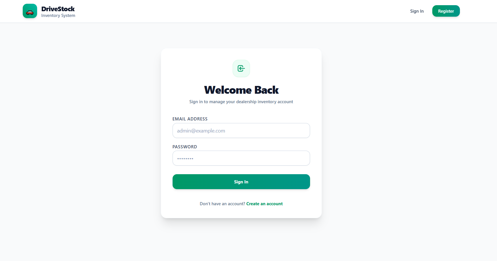
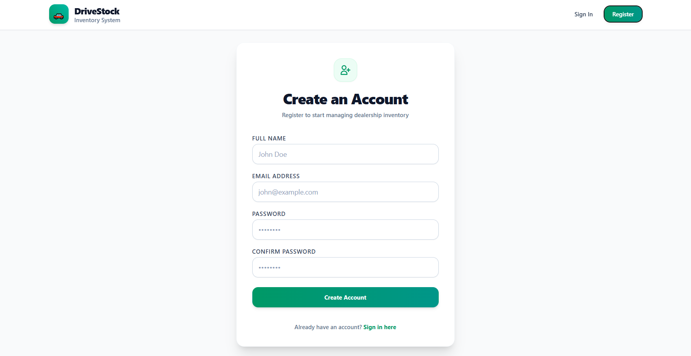
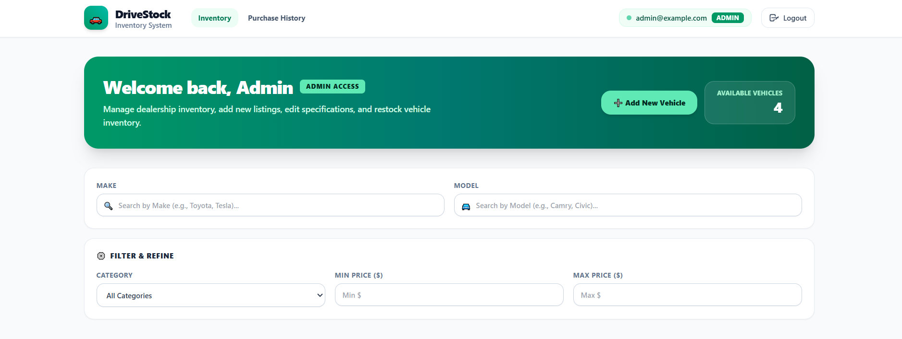
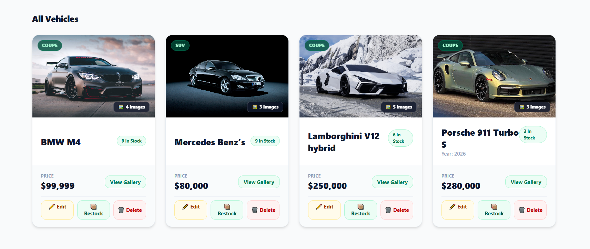
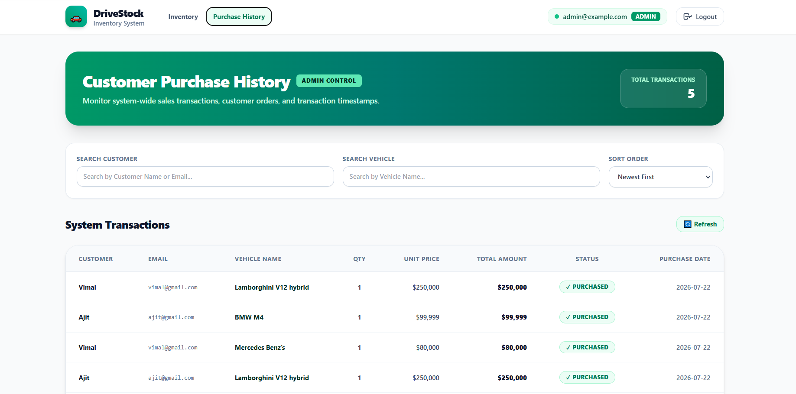
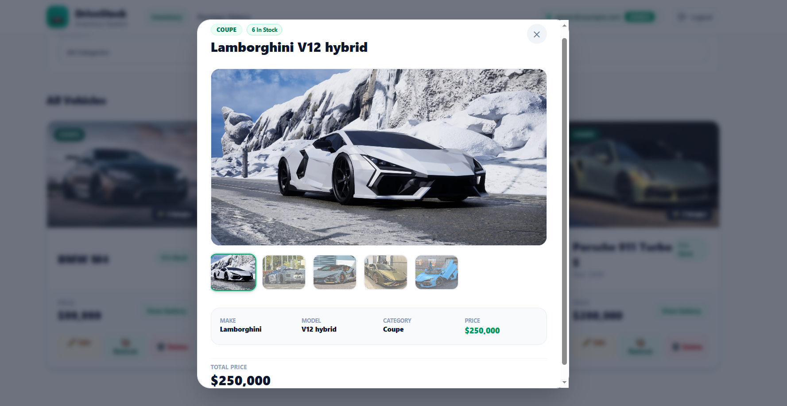
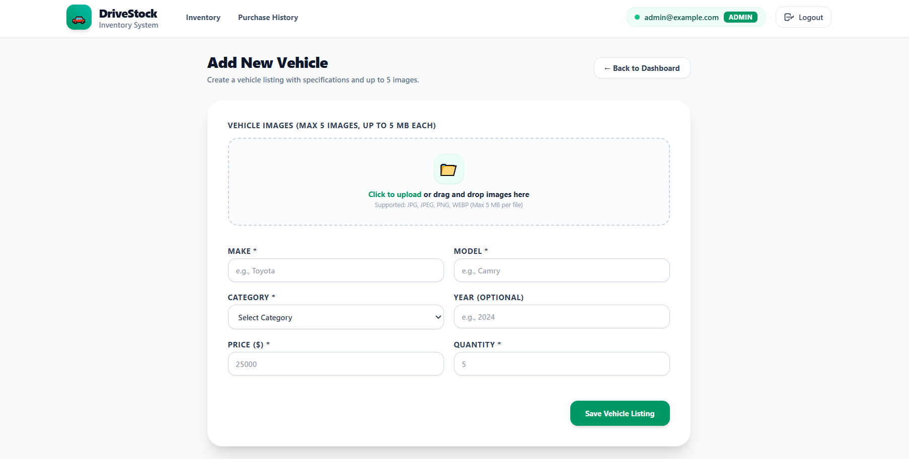
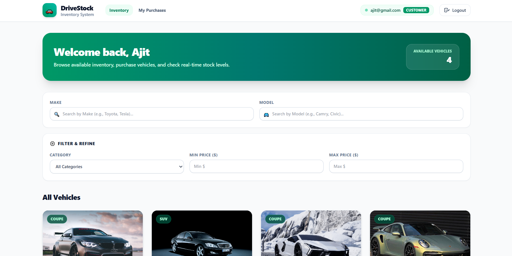

# 🚗 Car Dealership Inventory System

A full-stack MERN application for managing vehicle inventory with role-based authentication, purchase management, inventory tracking, and a modern responsive UI.

This project was developed following **Test-Driven Development (TDD)** practices for backend APIs and modern software engineering principles.

---

# ✨ Features

## Authentication

- User Registration
- User Login
- JWT Authentication
- Password Hashing (bcrypt)
- Role-Based Authorization
- Admin & Customer Roles
- Protected Routes

---

## Vehicle Management (Admin)

- Add Vehicle
- Update Vehicle
- Delete Vehicle
- Restock Vehicle
- Multiple Vehicle Images (up to 5)
- Vehicle Categories
- Vehicle Price
- Vehicle Quantity
- Vehicle Gallery with Thumbnail Preview

---

## Vehicle Browsing

- View All Vehicles
- Search Vehicles
- Filter by Make
- Filter by Model
- Filter by Category
- Filter by Price Range
- Responsive Vehicle Cards

---

## Purchase Module

Customers can:

- Purchase Vehicles
- View Purchase History
- View Purchase Date
- View Purchase Quantity
- View Purchase Price
- View Purchase Status

Admins can:

- View All Purchases
- View Customer Purchase History
- Track Vehicle Sales

---

## Image Management

- Upload Multiple Images
- Image Preview
- Thumbnail Gallery
- Main Image Viewer
- Remove Images
- File Validation
- Responsive Image Display

---

## Security

- JWT Authentication
- Protected APIs
- Admin-only Operations
- Input Validation
- Error Handling

---

## UI

- Green Modern Theme
- Responsive Design
- Mobile Friendly
- Loading States
- Empty States
- Toast Notifications
- Clean Dashboard

---

# 🛠 Tech Stack

## Frontend

- React
- TypeScript
- Vite
- Tailwind CSS
- React Router
- Axios

## Backend

- Node.js
- Express.js
- TypeScript
- MongoDB
- Mongoose
- JWT
- bcrypt
- Multer

## Testing

- Jest
- Supertest

---

# 📂 Project Structure

```text
car-dealership-inventory-system
│
├── backend
│   ├── src
│   │   ├── config
│   │   ├── controllers
│   │   ├── middleware
│   │   ├── models
│   │   ├── routes
│   │   ├── scripts
│   │   ├── services
│   │   ├── tests
│   │   ├── types
│   │   ├── utils
│   │   ├── app.ts
│   │   └── server.ts
│   │
│   ├── jest.config.js
│   ├── package.json
│   └── tsconfig.json
│
├── frontend
│   ├── public
│   │
│   ├── src
│   │   ├── api
│   │   ├── assets
│   │   ├── components
│   │   ├── pages
│   │   ├── routes
│   │   ├── services
│   │   ├── types
│   │   ├── App.tsx
│   │   └── main.tsx
│   │
│   ├── index.html
│   ├── package.json
│   └── eslint.config.js
│
├── README.md
├── PROMPTS.md
└── .gitignore
```

---

# 🚀 Installation

## Clone Repository

```bash
git clone https://github.com/ajitjada/car-dealership-inventory-system.git
```

---

## Backend

```bash
cd backend
npm install
```


Run

```bash
npm run dev
```

---

## Frontend

```bash
cd frontend

npm install

npm run dev
```

---

# Running Tests

Backend

```bash
npm test
```

Frontend

```bash
npm run test
```

---

# API Endpoints

## Authentication

POST /api/auth/register

POST /api/auth/login

GET /api/auth/profile

---

## Vehicles

GET /api/vehicles

GET /api/vehicles/search

POST /api/vehicles

PUT /api/vehicles/:id

DELETE /api/vehicles/:id

POST /api/vehicles/:id/restock

POST /api/vehicles/:id/purchase

---

## Purchases

GET /api/purchases

GET /api/purchases/me

---

# Screenshots

(Add screenshots here)

















---

# Future Improvements

- Dashboard Analytics
- Sales Reports
- Revenue Charts
- Low Stock Alerts
- Wishlist

---

# AI Usage Disclosure

AI tools were used as development assistants.

Antigravity AI

- Generated initial boilerplate
- Assisted with implementation
- Helped generate repetitive code

ChatGPT

- Assisted with architecture planning
- Guided Test-Driven Development workflow
- Reviewed backend design
- Suggested improvements
- Reviewed implementation strategy
- Helped with debugging and documentation

All generated code was reviewed, modified, tested, and integrated manually.

---

# Author

Ajit Jada

LD College of Engineering

Information Technology
